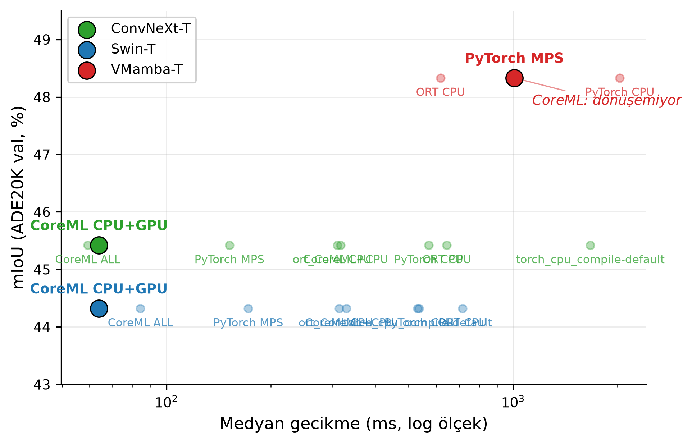
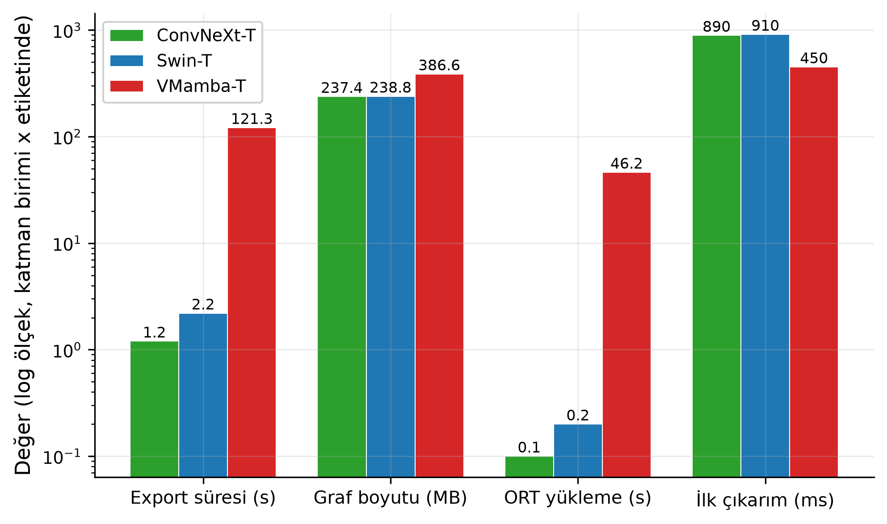
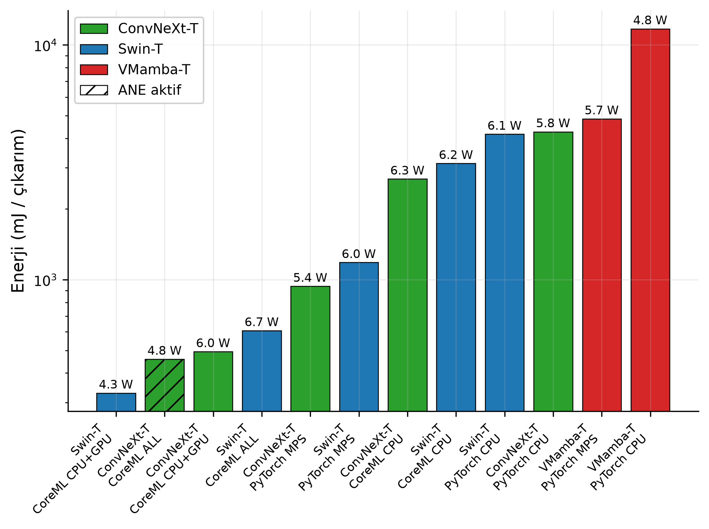
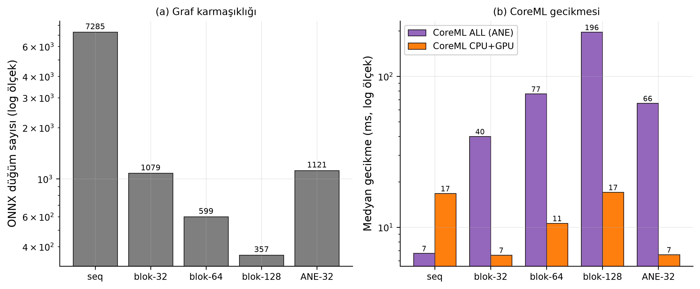

# Teoriden Silikona 🔬→🍎

**Durum-Uzayı Tabanlı Görü Omurgalarının Apple Silicon Uç Donanımında Gerçekleşen Verimliliğinin Ampirik Analizi**

*From Theory to Silicon: An Empirical Analysis of the Realized Efficiency of State-Space Vision Backbones on Apple Silicon Edge Hardware*

> Yüksek lisans tezi çalışması — tüm ölçüm altyapısı, ham veriler ve tez metni taslakları.
> **Ana bulgu:** SSM görü omurgalarının uç cihaz engeli *sayısal* değil, **yapısaldır** —
> sorun modelin yavaş çalışması değil, mevcut dağıtım araç zincirleriyle *çalışır hâle
> getirilememesidir.

---

## Araştırma Sorusu

Vision Mamba ailesi (VMamba vb.), Transformer'ın O(n²) dikkat maliyetine karşı lineer
karmaşıklık vaat ediyor ve literatürde yüksek çözünürlükte 2.8× hız / %86 bellek tasarrufu
bildiriliyor. Ancak bu sayıların tamamı **el yazması CUDA çekirdekleriyle, A100 sınıfı
donanımda** ölçülmüş durumda. Bu çalışma şu soruyu soruyor:

> **Teorik verimlilik avantajının ne kadarı, gerçek bir uç dağıtım yığınında
> (PyTorch eager/compile → ONNX Runtime → Core ML → Apple Neural Engine) hayatta kalıyor?**

Üç mimari ailesinin temsilcileri, **birebir aynı segmentasyon başlığı** (UPerNet, 31.5M
parametre — üçünde de aynı) ve aynı eğitim reçetesiyle (mmseg, ADE20K 160k iter)
karşılaştırılıyor:

| Omurga | Aile | mIoU (bildirilen → bu repo'da yeniden üretilen) |
|---|---|---|
| VMamba-T | SSM | 48.3 → **48.33** |
| Swin-T | Transformer | 44.41 → **44.32** |
| ConvNeXt-T | CNN | 46.11 → **45.42*** |

*\*"whole" test protokolü; bildirilen "slide" iledir — fark beklenen banttadır.*

## Ana Bulgular

### 1. Dört katmanlı maliyet modeli — FLOPs'un göremediği yer

Literatür yalnızca çıkarım gecikmesini raporlar. Gerçek dağıtım maliyeti dört katmandır
ve SSM'in cezası yanlış katmanda aranıyor:

| Katman (512², VMamba-T vs klasikler) | Sonuç |
|---|---|
| **Dönüşüm** | ONNX export 538 s (~250×); Core ML **hiç dönüşmüyor**; `torch.compile` **süreci çökertiyor** |
| **Yükleme** | ONNX Runtime 725 s (~7 000×) |
| **Paket boyutu** | 858 MB — 614 MB'ı ağırlık değil, unroll edilmiş graf **yapısı** |
| **Çıkarım** | **618 ms — eager'ının 0.30×'u, klasiklerle başa baş!** |

**ORT paradoksu:** ONNX Runtime'ın optimizer'ı 390 758 düğümlük unroll grafını yükleme
sırasında eritiyor — 12 dakikalık yüklemenin karşılığında çıkarım hızlı. Maliyet yok
olmuyor, katman değiştiriyor: her süreç başlatımında 12 dakika.

### 2. Çözünürlük ölçeklemesi — avantaj bölgesi = imkânsızlık bölgesi

SSM'in teorik üstünlük alanı yüksek çözünürlüktür. Tam o bölgede:

| VMamba-T ONNX | 256² | 512² | 1024² |
|---|---|---|---|
| Export | 121 s | 538 s | **✗ ~65 GB bellek → imkânsız** |
| Graf | 99K düğüm / 387 MB | 391K / 858 MB | — |

### 3. ANE gerçeği — mimari başına bir kademe (Xcode ile kanıtlı)

| | ConvNeXt-T | Swin-T | VMamba-T |
|---|---|---|---|
| ANE'ye atanan op | **353/353 (%100)** | **0/631 (%0)** | — (dönüşemiyor) |
| Enerji (mJ/çıkarım) | **458** (ANE) | 607 (GPU fallback) | 11 720 (CPU eager) — **25×** |

### 4. Nicemleme — engel sayısal değil

- **W8 bedava:** mIoU kaybı ±0, boyut ½, ConvNeXt'in ANE yolu %29 hızlandı
- **Kazanç yığına bağlı:** aynı INT8 fikri ORT-CPU'da 6-17× *yavaşlama*
- **Yapı nicemlenemiyor:** VMamba INT8: 858→715 MB, yükleme değişmedi
- **Sürpriz:** VMamba'nın aktivasyon aykırı-değer profili üçünün **en ılımlısı** ve
  çözünürlükle kararlı — literatürün "SSM aykırı değer canavarı" anlatısının tersi.
  **İroni: nicemlemeye en dayanıklı omurga, nicemlenecek formata zaten dönüşemiyor.**

## Şekiller

| | |
|---|---|
|  |  |
| *Şekil 4.1 — Doğruluk-gecikme Pareto düzlemi: VMamba'nın dağıtılabilir-en-iyi noktası sağda yalnız* | *Şekil 4.3 — Dört katmanlı maliyet: VMamba'nın export/yükleme çubukları log ölçekte ayrışıyor* |
|  |  |
| *Şekil 4.4 — Enerji/çıkarım: tek ANE-aktif hücre (ConvNeXt) taralı* | *Şekil 4.7 — Blok formu: düğüm 20×↓, CoreML kapısı açık* |

Tam tez taslağı (tek dosya, ~34.5K kelime): [`tez/TEZ-TAM-TASLAK.md`](tez/TEZ-TAM-TASLAK.md)

## Depo Yapısı

```
src/
  benchmark/     Ölçüm harness'ı: termal kontrol, yığın-agnostik runner'lar (torch/ORT/CoreML),
                 JSONL ham kayıt + ortam sürümü gömme; ResNet-50 ile doğrulanmış (≤%1.2 sapma)
  models/        mmseg'siz, anahtar-uyumlu saf-PyTorch yükleyiciler (VMamba/Swin/ConvNeXt + UPerNet)
                 + ADE20K mIoU değerlendiricisi (bildirilen sayıları birebir üretir)
  export/        Export matrisi hücre koşucusu (ONNX/CoreML; başarısızlıklar da kayıt altında)
  quant/         Nicemleme boru hattı (CoreML W8/W4, ORT INT8) + aktivasyon istatistikleri
  data/          ADE20K veri katmanı
  analysis/      Tez şekillerini üreten betikler
  premise/       Faz 0 öncül-doğrulama mikrobenchmark'ı (MiniMamba)
results/
  raw/           TÜM ham ölçümler (JSONL/JSON/npy) — başarısız denemeler dahil
  raw/xcode/     Xcode Core ML Performance Report kanıt görüntüleri
  figures/       Üretilmiş tez şekilleri (PDF+PNG)
tez/             Tez bölüm taslakları (Türkçe): Bölüm 2, 3, 4.1-4.4
tez-docs/        Analiz özetleri: export-matrisi.md, nicemleme-sonuclari.md, oncul-dogrulama.md,
                 vmamba-yamalari.md (upstream CPU-only hataları), literatür taraması
tez-plans/       Deney planı, tez iskeleti, Mac-only revizyon gerekçesi
tez-tasks/       Task takibi (37 task, faz bazlı) + session notları
```

## Yeniden Üretim

**Ortam:** Apple Silicon Mac (test: baz M5, 24 GB, macOS 26.5), Python 3.12.

```bash
git clone https://github.com/omergungor11/ssm-edge-thesis && cd ssm-edge-thesis
uv venv --python 3.12 && source .venv/bin/activate
uv pip install -r requirements.txt
```

Model checkpoint'leri (git dışı; `checkpoints/` altına):
[VMamba #v2seg](https://github.com/MzeroMiko/VMamba/releases) ·
[Swin-T](https://download.openmmlab.com/mmsegmentation/v0.5/swin/) ·
[ConvNeXt-T](https://download.openmmlab.com/mmsegmentation/v0.5/convnext/) — ve
ADE20K (`data/` altına). VMamba kodu için `third_party/VMamba` klonlanır; CPU-only
ortamda gereken 2 satırlık yamalar `tez-docs/vmamba-yamalari.md`'de (`[TEZ YAMASI]` etiketli).

```bash
# mIoU doğrulaması (bildirilen sayıları üretir)
python src/models/eval_ade20k.py 2000 --model vmamba
# Export matrisi hücresi
python src/export/export_cell.py vmamba onnx 512
# Gecikme matrisi / nicemleme
python src/benchmark/measure_matrix.py
python src/quant/quant_round1.py
```

Her ham kayıt; ortam sürümleri, git commit'i ve termal durumla damgalıdır.
**"Başarısızlık da veridir"** ilkesiyle başarısız export/derleme denemeleri de
`results/raw/export_matrix.jsonl` içindedir.

## Durum

Faz 0-3 tamamlandı (öncül doğrulama → model doğrulama → dağıtım matrisi → nicemleme).
Devam eden: Faz 4 — `selective scan`'in ANE-dostu yeniden formülasyonu (özgün katkı),
Faz 5 — tez metni toparlama. Ayrıntı: `tez-tasks/task-index.md`.

## Lisans

[MIT](LICENSE) © 2026 Ömer Faruk Güngör

Üçüncü parti bileşenler kendi lisanslarına tabidir: VMamba (MIT), mmsegmentation
checkpoint'leri (Apache-2.0), ADE20K (BSD — akademik kullanım).
